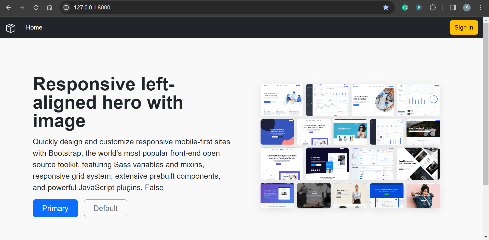
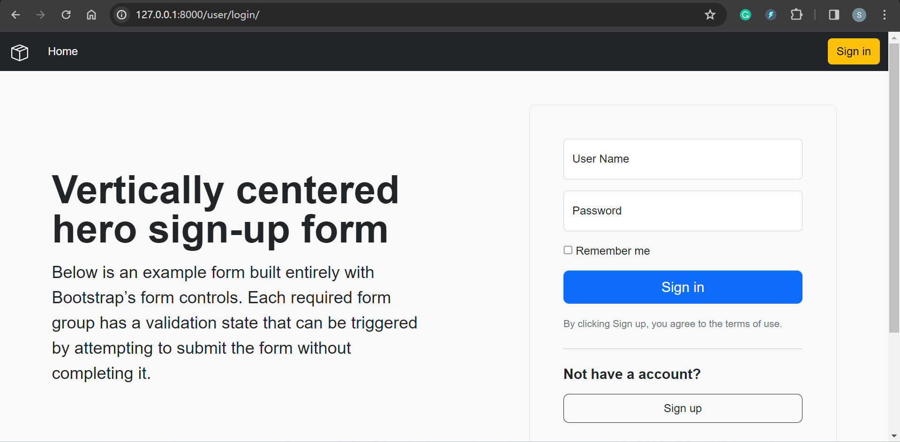
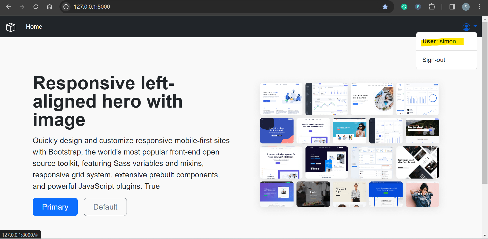

# Django-Project

Project for Udemy course

- admin
- admin@talentpool.com
- admin

---

- Home

- Sign-in

---

- Level # 4
- [x] Reorganized Project
- [x] Create project TalentPoolPro
- [x] Create app TalentPoolWeb

- Functionality
  - [x] Main Page
    - [x] template: base.html, index.html
    - [x] url: include
  - [x] Loggin Page
    - [x] template: login, logout
    - [x] url+view
  - [x] Register: Using default User model
    - [x] template: register
    - [x] url+view

---

- Level #3.1
- [x] Model: Employee, Department
- [x] template: base, extends
  - [x] index, succes
- [x] Department
  - [x] Form
  - [x] View: list, add, delete
  - [x] Url
  - [x] Template
- [x] Employee
  - [x] Form
  - [x] View: list, add, delete
  - [x] Url
  - [x] Template

---

- Level #3
- [x] form class
- [x] View
- [x] Url
- [x] Templates

---

- Level #2
- [x] Create Project: EmployeeProject
- [x] Create Application: EmployeeApp
- [x] Update EmployeeApp
  - [x] Model: Employ
  - [x] migrate
  - [x] admin: register
  - [x] View: index
  - [x] Template: index.html
  - [x] superuser
  - [x] admin link
- [x] Static Files
